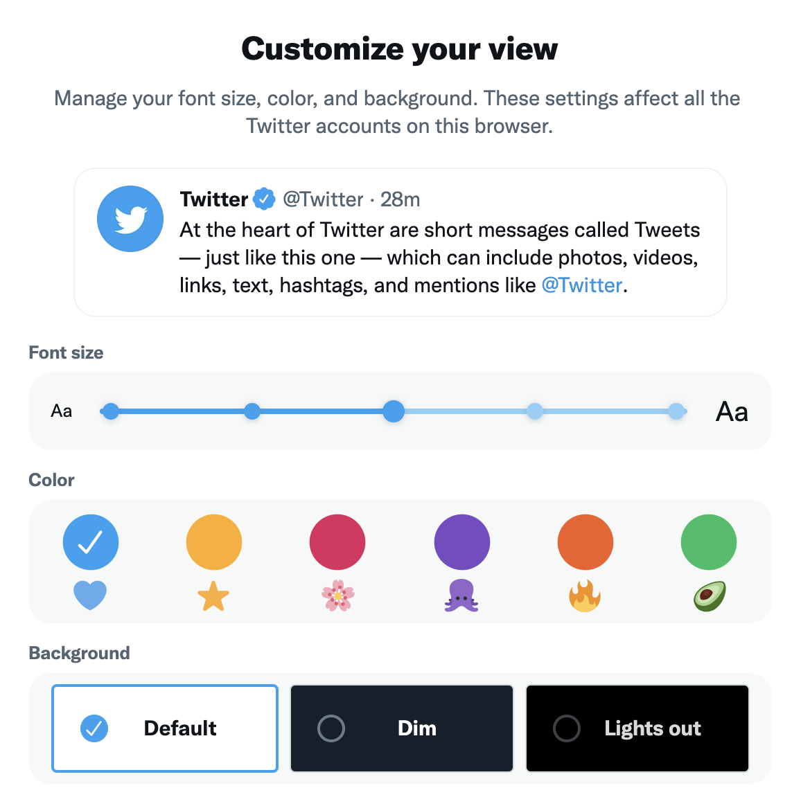
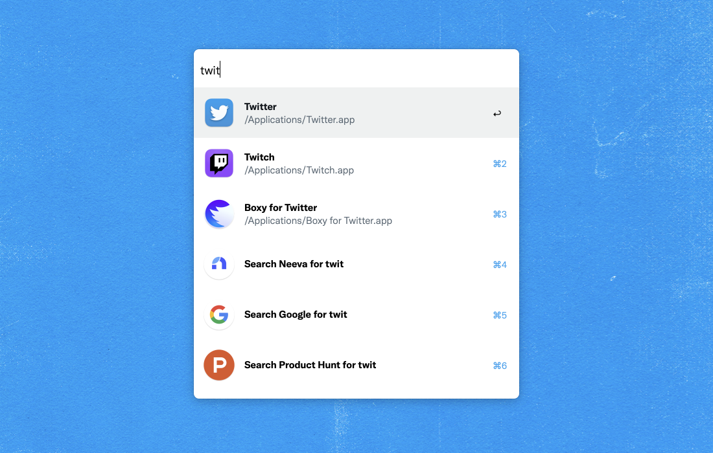
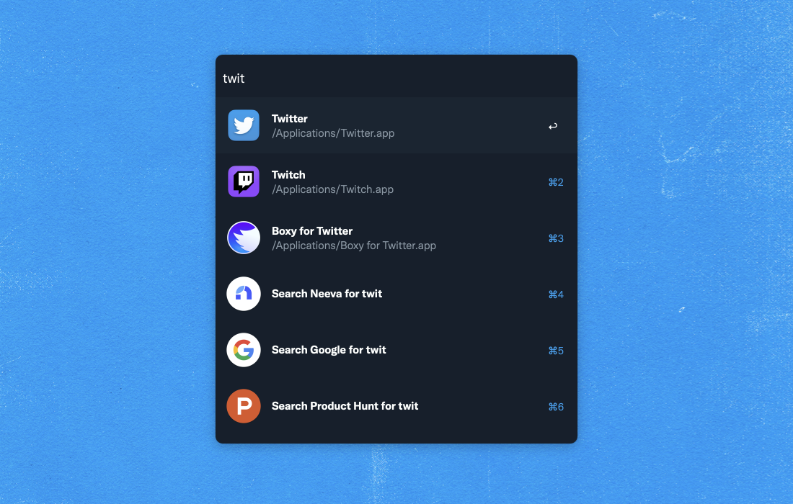
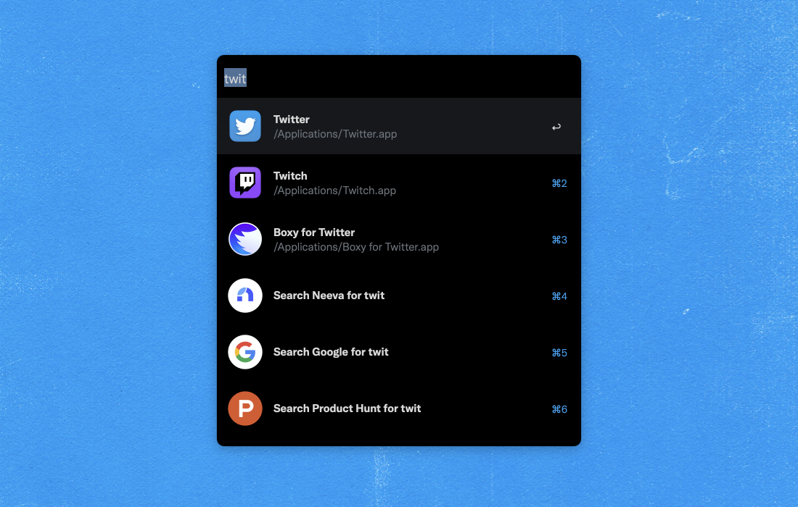
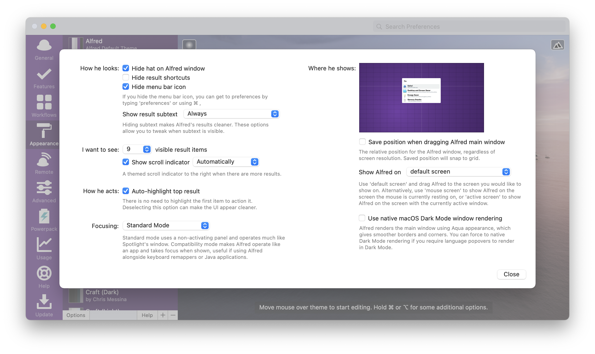
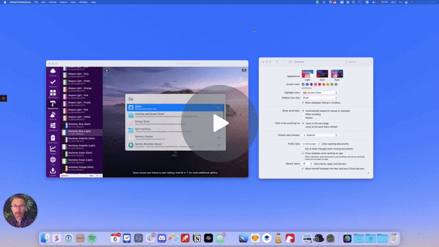

# Chirp Powerpack Theme Collection for Alfred

This is a collection of 18 [Alfred Powerpack Themes](https://www.alfredapp.com/help/appearance/) inspired by Twitter's [custom typeface Chirp](https://twitter.com/DerritDeRouen/status/1354548649561186306) and its [customizable view options](https://twitter.com/i/display):

[**Download Themes**](https://github.com/chrismessina/alfred-theme-chirp/releases/latest)

## Installation

This theme uses the Chirp font, which is not available for public distribution. If you happen to obtain it, use the themes in the "Chirp" folder.

Alternatively, since Chirp is just a custom version of Grilli Type's [GT America](https://www.grillitype.com/typeface/gt-america), you can [download a free trial](https://www.grillitype.com/free-trial-fonts) and use that. Once you've installed **GT America Trial Lt** and **GT America Trial Bd**, you can install the themes in the "GT America" folder. Note that the trial version of GT America doesn’t contain kerning, accents, alternate characters or other OpenType features.

You can either double-click an `.alfredappearance` file to install it or use [@vitor](https://github.com/vitorgalvao)'s [Batch Theme Importer Workflow](https://raw.githubusercontent.com/vitorgalvao/requested-alfred-workflows/master/Workflows/Batch%20Import%20Themes.alfredworkflow) to import them all at once.

## Previews

Only the Blue variant with Chirp is shown here.

### Default

### Dim

### Lights Out

## Suggested configuration

- Disable the Alfred hat logo by checking: `Alfred Preferences › Appearance › Options › Hide hat on Alfred window`
- Disable result shortcuts by unchecking: `Alfred Preferences › Appearance › Options › Hide result shortcuts`
- Show result subtext "Always".

## Sync your Alfred Theme with your System Appearance

## Show your appreciation

If you like the Alfred Workflows and Themes that I make, I invite you to participate in the $HASH economy! You can [purchase $HASH coins](https://chrismessina.me/coin) and earn rewards by joining the broader Rally Creator Community.

## About

This theme is unaffiliated with nor endorsed by Twitter, Inc. All trademarks are the property of their respective owners.
